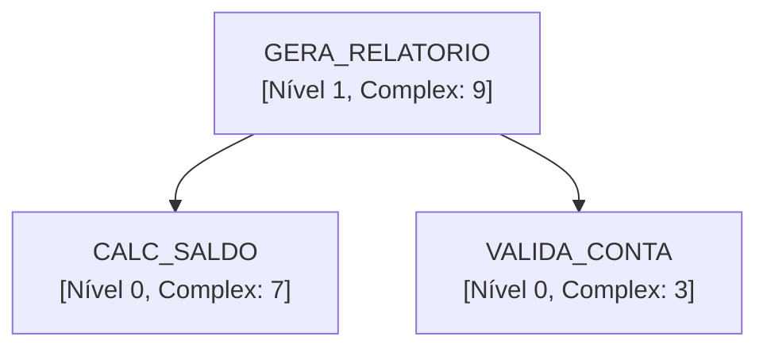

# CodeGraphAI - Integration Flows

## Table of Contents

- [Overview](#overview)
- [File Analysis Flow](#file-analysis-flow)
- [Database Analysis Flow](#database-analysis-flow)
- [Export Flow](#export-flow)
- [CLI Usage Examples](#cli-usage-examples)
- [Programmatic Usage](#programmatic-usage)
- [Related Documentation](#related-documentation)

---

## Overview

Este documento descreve os fluxos de integração e uso do CodeGraphAI, incluindo diagramas de sequência e exemplos práticos.

---

## File Analysis Flow

### Diagrama de Sequência

```
User
 │
 ├─> CLI: analyze-files
 │    │
 │    ├─> ProcedureAnalyzer.analyze_from_files()
 │    │    │
 │    │    ├─> ProcedureLoader.from_files()
 │    │    │    │
 │    │    │    └─> FileLoader.from_files()
 │    │    │         │
 │    │    │         ├─> Lê arquivos .prc
 │    │    │         │
 │    │    │         └─> Retorna Dict[str, str]
 │    │    │
 │    │    ├─> Para cada procedure:
 │    │    │    │
 │    │    │    ├─> LLMAnalyzer.analyze_business_logic()
 │    │    │    │    │
 │    │    │    │    └─> LLM Chain → business_logic
 │    │    │    │
 │    │    │    ├─> LLMAnalyzer.analyze_dependencies()
 │    │    │    │    │
 │    │    │    │    ├─> Regex extraction
 │    │    │    │    │
 │    │    │    │    └─> LLM validation → dependencies
 │    │    │    │
 │    │    │    ├─> LLMAnalyzer.analyze_complexity()
 │    │    │    │    │
 │    │    │    │    ├─> LLM analysis
 │    │    │    │    │
 │    │    │    │    └─> Heuristic fallback → complexity_score
 │    │    │    │
 │    │    │    └─> Cria ProcedureInfo
 │    │    │
 │    │    ├─> Constrói grafo (NetworkX)
 │    │    │
 │    │    └─> Calcula níveis hierárquicos
 │    │
 │    └─> Exporta resultados
 │
 └─> Retorna estatísticas
```

### Exemplo CLI

```bash
# Análise básica
python main.py analyze-files \
    --directory ./procedures \
    --extension prc \
    --output-dir ./output

# Com exportação Mermaid
python main.py analyze-files \
    --directory ./procedures \
    --extension prc \
    --export-mermaid \
    --output-dir ./output

# Com modelo customizado
python main.py analyze-files \
    --directory ./procedures \
    --model llama-2-7b \
    --device cpu \
    --output-dir ./output
```

### Exemplo Programático

```python
from analyzer import LLMAnalyzer, ProcedureAnalyzer

# Inicializa LLM
llm = LLMAnalyzer(
    model_name="gpt-oss-120b",
    device="cuda"
)

# Cria analisador
analyzer = ProcedureAnalyzer(llm)

# Analisa arquivos
analyzer.analyze_from_files("./procedures", "prc")

# Exporta resultados
analyzer.export_results("analysis.json")
analyzer.export_mermaid_diagram("diagram.md")
analyzer.export_mermaid_hierarchy("hierarchy.md")
```

---

## Database Analysis Flow

### Diagrama de Sequência

```
User
 │
 ├─> CLI: analyze-db
 │    │
 │    ├─> Valida parâmetros
 │    │
 │    ├─> ProcedureAnalyzer.analyze_from_database()
 │    │    │
 │    │    ├─> Determina DatabaseType
 │    │    │
 │    │    ├─> Cria DatabaseConfig
 │    │    │
 │    │    ├─> Factory.create_loader(db_type)
 │    │    │    │
 │    │    │    ├─> Verifica registry
 │    │    │    │
 │    │    │    ├─> Importa loader se necessário
 │    │    │    │
 │    │    │    └─> Retorna loader específico
 │    │    │
 │    │    ├─> loader.load_procedures(config)
 │    │    │    │
 │    │    │    ├─> Conecta ao banco
 │    │    │    │
 │    │    │    ├─> Executa query para listar procedures
 │    │    │    │
 │    │    │    ├─> Para cada procedure:
 │    │    │    │    │
 │    │    │    │    └─> Executa query para obter código
 │    │    │    │
 │    │    │    └─> Retorna Dict[str, str]
 │    │    │
 │    │    └─> Continua como análise de arquivos...
 │    │
 │    └─> Exporta resultados
 │
 └─> Retorna estatísticas
```

### Exemplo CLI - Oracle

```bash
python main.py analyze-db \
    --db-type oracle \
    --user usuario \
    --password senha \
    --dsn localhost:1521/ORCL \
    --schema MEU_SCHEMA \
    --limit 100 \
    --output-dir ./output
```

### Exemplo CLI - PostgreSQL

```bash
python main.py analyze-db \
    --db-type postgresql \
    --user usuario \
    --password senha \
    --host localhost \
    --port 5432 \
    --database meu_banco \
    --schema public \
    --output-dir ./output
```

### Exemplo CLI - SQL Server

```bash
python main.py analyze-db \
    --db-type mssql \
    --user usuario \
    --password senha \
    --host localhost \
    --port 1433 \
    --database meu_banco \
    --schema dbo \
    --output-dir ./output
```

### Exemplo CLI - MySQL

```bash
python main.py analyze-db \
    --db-type mysql \
    --user usuario \
    --password senha \
    --host localhost \
    --port 3306 \
    --database meu_banco \
    --output-dir ./output
```

### Exemplo Programático

```python
from analyzer import LLMAnalyzer, ProcedureAnalyzer
from app.core.models import DatabaseType, DatabaseConfig

# Inicializa LLM
llm = LLMAnalyzer()

# Cria analisador
analyzer = ProcedureAnalyzer(llm)

# Analisa do banco
analyzer.analyze_from_database(
    user="usuario",
    password="senha",
    dsn="localhost:1521/ORCL",
    schema="MEU_SCHEMA",
    db_type="oracle"
)

# Exporta resultados
analyzer.export_results("analysis.json")
```

---

## Export Flow

### Diagrama de Sequência

```
User
 │
 ├─> ProcedureAnalyzer.export_*()
 │    │
 │    ├─> export_results()
 │    │    │
 │    │    ├─> Serializa ProcedureInfo
 │    │    │
 │    │    └─> Escreve JSON
 │    │
 │    ├─> visualize_dependencies()
 │    │    │
 │    │    ├─> Constrói grafo NetworkX
 │    │    │
 │    │    ├─> Layout (spring_layout)
 │    │    │
 │    │    └─> Renderiza PNG (matplotlib)
 │    │
 │    ├─> export_mermaid_diagram()
 │    │    │
 │    │    ├─> Gera código Mermaid
 │    │    │
 │    │    └─> Escreve .md
 │    │
 │    └─> export_mermaid_hierarchy()
 │         │
 │         ├─> Agrupa por níveis
 │         │
 │         └─> Gera hierarquia Mermaid
 │
 └─> Arquivos gerados
```

### Formatos de Exportação

#### JSON

```json
{
  "procedures": {
    "calc_saldo": {
      "name": "calc_saldo",
      "schema": "core",
      "parameters": [...],
      "called_procedures": ["valida_conta"],
      "called_tables": ["contas", "transacoes"],
      "business_logic": "...",
      "complexity_score": 7,
      "dependencies_level": 0
    }
  },
  "metadata": {
    "total_procedures": 10,
    "analysis_date": "2024-11-23T16:45:00"
  }
}
```

#### Mermaid Diagram



#### PNG

Grafo visual gerado com matplotlib, mostrando:
- Nós: Procedures
- Arestas: Dependências
- Cores: Níveis de complexidade

---

## CLI Usage Examples

### Análise Completa

```bash
# Verbose mode
python main.py --verbose analyze-files \
    --directory ./procedures \
    --export-json \
    --export-png \
    --export-mermaid \
    --output-dir ./output
```

### Com Logging

```bash
python main.py \
    --log-file ./logs/analysis.log \
    analyze-db \
    --db-type oracle \
    --user usuario \
    --password senha \
    --dsn localhost:1521/ORCL
```

### Análise Limitada

```bash
python main.py analyze-db \
    --db-type postgresql \
    --user usuario \
    --password senha \
    --host localhost \
    --database meu_banco \
    --limit 50 \
    --output-dir ./output
```

---

## Programmatic Usage

### Exemplo Completo

```python
import logging
from analyzer import LLMAnalyzer, ProcedureAnalyzer
from app.core.models import DatabaseType

# Configura logging
logging.basicConfig(level=logging.INFO)

# Inicializa LLM
llm = LLMAnalyzer(
    model_name="gpt-oss-120b",
    device="cuda",
    max_new_tokens=1024,
    temperature=0.3
)

# Cria analisador
analyzer = ProcedureAnalyzer(llm)

# Analisa procedures
analyzer.analyze_from_files("./procedures", "prc")

# Acessa resultados
for name, procedure in analyzer.procedures.items():
    print(f"{name}: complexidade {procedure.complexity_score}")

# Obtém hierarquia
hierarchy = analyzer.get_procedure_hierarchy()
for level, procedures in sorted(hierarchy.items()):
    print(f"Nível {level}: {len(procedures)} procedures")

# Exporta tudo
analyzer.export_results("analysis.json")
analyzer.visualize_dependencies("graph.png")
analyzer.export_mermaid_diagram("diagram.md")
analyzer.export_mermaid_hierarchy("hierarchy.md")
```

### Exemplo com Tratamento de Erros

```python
from analyzer import ProcedureAnalyzer, LLMAnalyzer
from app.core.models import (
    CodeGraphAIError,
    ProcedureLoadError,
    LLMAnalysisError
)

try:
    llm = LLMAnalyzer()
    analyzer = ProcedureAnalyzer(llm)

    analyzer.analyze_from_database(
        user="usuario",
        password="senha",
        dsn="localhost:1521/ORCL"
    )

except ProcedureLoadError as e:
    print(f"Erro ao carregar procedures: {e}")
except LLMAnalysisError as e:
    print(f"Erro na análise LLM: {e}")
except CodeGraphAIError as e:
    print(f"Erro geral: {e}")
```

---

## Related Documentation

- [Project Overview](project-overview.md) - Visão geral
- [Architecture Details](architecture.md) - Arquitetura
- [API Catalog](api-catalog.md) - Referência de APIs
- [Database Adapters](database-adapters.md) - Adaptadores

---

Generated on: 2024-11-23 16:45:00

