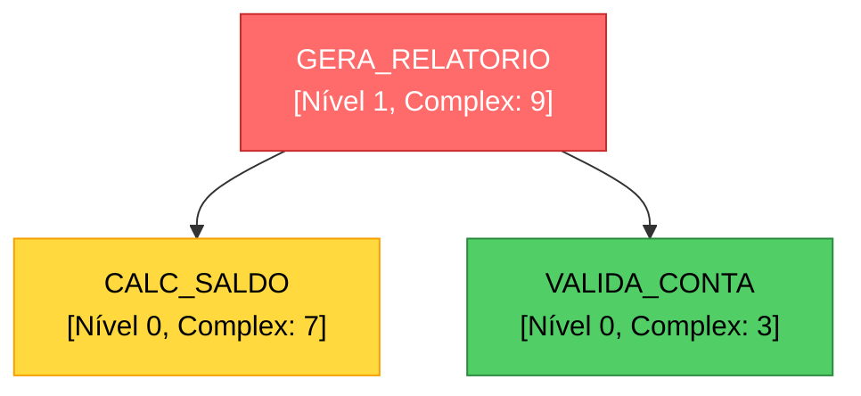

# CodeGraphAI 🔍

> Análise inteligente de procedures de banco de dados usando IA local

CodeGraphAI é uma ferramenta Python que utiliza LLMs (Large Language Models) para analisar, mapear e visualizar dependências entre stored procedures de bancos de dados. Identifica relacionamentos, calcula complexidade e gera hierarquias de baixo até alto nível automaticamente.


## ✨ Funcionalidades

- 🤖 **Análise com IA Local** - Usa modelos LLM (GPT-OSS-120B, Llama, etc.) para entender lógica de negócio
- 📊 **Mapeamento de Dependências** - Identifica chamadas entre procedures e acessos a tabelas
- 🎯 **Hierarquia Bottom-Up** - Organiza procedures do nível mais baixo (sem dependências) até alto nível
- 📈 **Cálculo de Complexidade** - Score de 1-10 baseado em estrutura e lógica do código
- 🎨 **Visualizações Mermaid** - Gera diagramas interativos em markdown
- 💾 **Análise de Arquivos** - Trabalha com arquivos `.prc` locais (sem necessidade de conexão ao banco)
- 🔄 **Agnóstico de Banco** - Suporta Oracle, SQL Server, PostgreSQL e outros (extensível)

## 🚀 Quick Start

### Instalação

```bash
# Clone o repositório
git clone https://github.com/seu-usuario/CodeGraphAI.git
cd CodeGraphAI

# Crie ambiente virtual
python -m venv venv
source venv/bin/activate  # Linux/Mac
# ou
venv\Scripts\activate  # Windows

# Instale dependências
pip install -r requirements.txt
```

### Uso Básico

```python
from analyzer import LLMAnalyzer, ProcedureAnalyzer

# 1. Inicializa analisador com modelo local
llm = LLMAnalyzer(
    model_name="gpt-oss-120b",  # ou caminho local
    device="cuda"
)

# 2. Cria analisador de procedures
analyzer = ProcedureAnalyzer(llm)

# 3. Analisa procedures de arquivos .prc
analyzer.analyze_from_files("./procedures", extension="prc")

# 4. Exporta resultados
analyzer.export_results("analysis.json")
analyzer.export_mermaid_diagram("diagram.md")
analyzer.export_mermaid_hierarchy("hierarchy.md")
```

## 📋 Requisitos

### Dependências Python

```txt
oracledb>=1.4.0          # Conexão Oracle (opcional)
langchain>=0.1.0
langchain-community>=0.0.13
transformers>=4.35.0
torch>=2.0.0
networkx>=3.0
matplotlib>=3.7.0
accelerate>=0.25.0
bitsandbytes>=0.41.0     # Para quantização 8-bit
```

### Hardware Recomendado

- **GPU**: NVIDIA com 24GB+ VRAM para modelos 120B (ou use quantização)
- **CPU**: 16+ cores para processamento paralelo
- **RAM**: 32GB+ recomendado
- **Storage**: Depende do tamanho do modelo

## 📂 Estrutura do Projeto

```
CodeGraphAI/
├── analyzer.py              # Script principal
├── requirements.txt         # Dependências
├── README.md               # Este arquivo
├── procedures/             # Diretório com arquivos .prc
│   ├── core/
│   │   ├── calc_saldo.prc
│   │   └── valida_cliente.prc
│   └── reports/
│       └── gera_relatorio.prc
└── output/                 # Resultados gerados
    ├── analysis.json
    ├── diagram.md
    └── hierarchy.md
```

## 🎯 Casos de Uso

### 1. Análise de Arquivos Locais (Recomendado)

```python
analyzer = ProcedureAnalyzer(llm)
analyzer.analyze_from_files("./procedures", "prc")
```

**Vantagens:**

- ✅ Mais rápido (sem latência de rede)
- ✅ Funciona offline
- ✅ Versionável com Git
- ✅ Sem necessidade de credenciais

### 2. Análise Direta do Banco

```python
analyzer.analyze_from_database(
    user="usuario",
    password="senha",
    dsn="localhost:1521/ORCL",
    schema="MEU_SCHEMA"
)
```

**Quando usar:**

- Procedures não estão em arquivos
- Precisa de metadados adicionais do banco
- Análise ad-hoc de ambiente de produção

### 3. Análise Híbrida

```python
# Carrega de arquivos
analyzer.analyze_from_files("./procedures")

# Compara com banco para validar sincronização
from analyzer import ProcedureLoader
db_procs = ProcedureLoader.from_database(user, password, dsn)

file_set = set(analyzer.procedures.keys())
db_set = set(db_procs.keys())

print(f"Apenas em arquivos: {file_set - db_set}")
print(f"Apenas no banco: {db_set - file_set}")
```

## 📊 Tipos de Visualização

### 1. Diagrama de Dependências

```python
analyzer.export_mermaid_diagram("diagram.md", max_nodes=50)
```

Gera grafo mostrando todas as dependências com cores por complexidade:

- 🔴 **Vermelho**: Alta complexidade (8-10)
- 🟡 **Amarelo**: Média complexidade (5-7)
- 🟢 **Verde**: Baixa complexidade (1-4)

### 2. Hierarquia por Níveis

```python
analyzer.export_mermaid_hierarchy("hierarchy.md")
```

Organiza procedures em árvore hierárquica:

- **Nível 0**: Procedures base (sem dependências)
- **Nível 1**: Dependem apenas do nível 0
- **Nível N**: Dependem até o nível N-1

### 3. Flowchart Detalhado

```python
analyzer.export_mermaid_flowchart("SCHEMA.PROCEDURE_NAME")
```

Mostra fluxo completo de uma procedure:

- Parâmetros de entrada/saída
- Tabelas acessadas
- Procedures chamadas
- Lógica de negócio

## 🔧 Configuração Avançada

### Modelos LLM Suportados

```python
# Modelos Locais
llm = LLMAnalyzer(model_name="gpt-oss-120b", device="cuda")
llm = LLMAnalyzer(model_name="meta-llama/Llama-2-70b-hf", device="cuda")
llm = LLMAnalyzer(model_name="mistralai/Mixtral-8x7B-v0.1", device="cuda")

# Caminho local
llm = LLMAnalyzer(model_name="/path/to/local/model", device="cuda")

# CPU (mais lento)
llm = LLMAnalyzer(model_name="gpt-oss-120b", device="cpu")
```

### Quantização para Economia de Memória

Por padrão, usa quantização 8-bit. Para modelos menores:

```python
# Desabilitar quantização (requer mais VRAM)
# Edite em analyzer.py:
model = AutoModelForCausalLM.from_pretrained(
    model_name,
    device_map="auto",
    load_in_8bit=False,  # Altere aqui
    torch_dtype="auto"
)
```

### Ajuste de Prompts

Edite os templates em `LLMAnalyzer._setup_prompts()` para customizar análises:

```python
self.business_logic_prompt = PromptTemplate(
    input_variables=["code", "proc_name"],
    template="""Seu prompt customizado aqui..."""
)
```

## 📈 Exemplo de Output

### JSON (analysis.json)

```json
{
  "procedures": {
    "CALC_SALDO": {
      "name": "CALC_SALDO",
      "schema": "FINANCEIRO",
      "complexity_score": 7,
      "dependencies_level": 0,
      "called_procedures": ["VALIDA_CONTA", "BUSCA_HISTORICO"],
      "called_tables": ["CONTAS", "TRANSACOES"],
      "business_logic": "Calcula saldo atual de uma conta..."
    }
  },
  "hierarchy": {
    "0": ["CALC_SALDO", "VALIDA_CONTA"],
    "1": ["GERA_RELATORIO"],
    "2": ["EXPORTA_DADOS"]
  },
  "statistics": {
    "total_procedures": 45,
    "avg_complexity": 5.8,
    "max_dependency_level": 4
  }
}
```

### Mermaid Diagram



## 🤝 Contribuindo

Contribuições são bem-vindas! Por favor:

1. Fork o projeto
2. Crie uma branch para sua feature (`git checkout -b feature/AmazingFeature`)
3. Commit suas mudanças (`git commit -m 'Add some AmazingFeature'`)
4. Push para a branch (`git push origin feature/AmazingFeature`)
5. Abra um Pull Request

## 🗺
