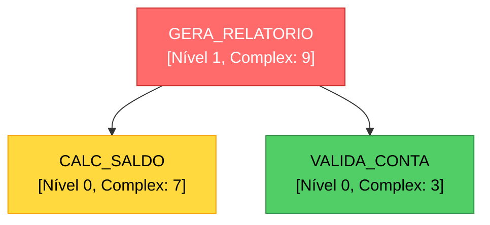

# CodeGraphAI 🔍

> Análise inteligente de procedures e tabelas de banco de dados usando IA local

CodeGraphAI é uma ferramenta Python que utiliza LLMs (Large Language Models) para analisar, mapear e visualizar dependências entre stored procedures e tabelas de bancos de dados. Identifica relacionamentos, calcula complexidade e gera hierarquias de baixo até alto nível automaticamente. Permite escolher entre analisar apenas procedures, apenas tabelas ou ambos através da flag `--analysis-type`.


## ✨ Funcionalidades

- 🤖 **Análise com IA Local** - Usa modelos LLM (GPT-OSS-120B, Llama, etc.) para entender lógica de negócio
- 📊 **Mapeamento de Dependências** - Identifica chamadas entre procedures e acessos a tabelas
- 🗄️ **Análise de Tabelas** - Analisa estrutura de tabelas (DDL, relacionamentos, índices, foreign keys)
- 🎯 **Hierarquia Bottom-Up** - Organiza procedures e tabelas do nível mais baixo (sem dependências) até alto nível
- 📈 **Cálculo de Complexidade** - Score de 1-10 baseado em estrutura e lógica do código
- 🎨 **Visualizações Mermaid** - Gera diagramas interativos em markdown (procedures e tabelas)
- 💾 **Análise de Arquivos** - Trabalha com arquivos `.prc` locais (sem necessidade de conexão ao banco)
- 🔄 **Agnóstico de Banco** - Suporta Oracle, PostgreSQL, SQL Server e MySQL através de adaptadores
- 🎛️ **Análise Flexível** - Escolha entre analisar tabelas, procedures ou ambos com flag `--analysis-type`

## 🚀 Quick Start

### Instalação

```bash
# Clone o repositório
git clone https://github.com/seu-usuario/CodeGraphAI.git
cd CodeGraphAI

# Crie ambiente virtual
python -m venv venv
source venv/bin/activate  # Linux/Mac
# ou
venv\Scripts\activate  # Windows

# Instale dependências
pip install -r requirements.txt

# Configure variáveis de ambiente
# Copie o arquivo de exemplo e preencha com suas credenciais
cp example.env .env
# ou
cp example.env environment.env
# Edite .env ou environment.env com suas credenciais reais
```

### Uso Básico

#### Via CLI (Recomendado)

```bash
# Análise de tabelas (PostgreSQL)
python main.py analyze --analysis-type=tables \
    --db-type postgresql \
    --user postgres --password senha \
    --host localhost --port 5432 \
    --database meu_banco --schema public

# Análise de procedures (Oracle)
python main.py analyze --analysis-type=procedures \
    --db-type oracle \
    --user usuario --password senha \
    --dsn localhost:1521/ORCL --schema MEU_SCHEMA

# Análise de ambos (padrão)
python main.py analyze --analysis-type=both \
    --db-type postgresql \
    --user postgres --password senha \
    --host localhost --port 5432 \
    --database meu_banco --schema public
```

#### Via Python

```python
from analyzer import LLMAnalyzer, ProcedureAnalyzer

# 1. Inicializa analisador com modelo local
llm = LLMAnalyzer(
    model_name="gpt-oss-120b",  # ou caminho local
    device="cuda"
)

# 2. Cria analisador de procedures
analyzer = ProcedureAnalyzer(llm)

# 3. Analisa procedures de arquivos .prc
analyzer.analyze_from_files("./procedures", extension="prc")

# 4. Exporta resultados
analyzer.export_results("analysis.json")
analyzer.export_mermaid_diagram("diagram.md")
analyzer.export_mermaid_hierarchy("hierarchy.md")
```

## 📋 Requisitos

### Dependências Python

```txt
# Bancos de Dados (opcional - instale apenas os necessários)
oracledb>=1.4.0              # Oracle
psycopg2-binary>=2.9.0       # PostgreSQL
pyodbc>=5.0.0                # SQL Server (via ODBC)
mysql-connector-python>=8.0.0  # MySQL

# LangChain - Framework para LLM
langchain>=0.1.0
langchain-community>=0.0.13

# Transformers e PyTorch - Modelos de IA
transformers>=4.35.0
torch>=2.0.0
accelerate>=0.25.0
bitsandbytes>=0.41.0         # Para quantização 8-bit

# Análise de Grafos
networkx>=3.0

# Visualização
matplotlib>=3.7.0

# CLI e Utilitários
click>=8.0.0
tqdm>=4.65.0
python-dotenv>=1.0.0
```

### Hardware Recomendado

- **GPU**: NVIDIA com 24GB+ VRAM para modelos 120B (ou use quantização)
- **CPU**: 16+ cores para processamento paralelo
- **RAM**: 32GB+ recomendado
- **Storage**: Depende do tamanho do modelo

## 📂 Estrutura do Projeto

```
CodeGraphAI/
├── app/                    # Módulos principais
│   ├── core/              # Modelos e exceções
│   │   └── models.py      # ProcedureInfo, TableInfo, etc.
│   ├── io/                # Adaptadores de banco de dados
│   │   ├── base.py        # Interface abstrata (procedures)
│   │   ├── table_base.py  # Interface abstrata (tabelas)
│   │   ├── factory.py     # Factory pattern (procedures)
│   │   ├── table_factory.py # Factory pattern (tabelas)
│   │   ├── oracle_loader.py
│   │   ├── oracle_table_loader.py
│   │   ├── postgres_loader.py
│   │   ├── postgres_table_loader.py
│   │   ├── mssql_loader.py
│   │   ├── mssql_table_loader.py
│   │   ├── mysql_loader.py
│   │   ├── mysql_table_loader.py
│   │   └── file_loader.py
│   ├── llm/               # Integração com LLMs
│   │   └── langchain_wrapper.py
│   └── config/            # Configuração
│       └── config.py
├── analyzer.py            # LLMAnalyzer e ProcedureAnalyzer
├── table_analyzer.py      # TableAnalyzer
├── main.py                # CLI (comando analyze unificado)
├── config.py              # Wrapper de compatibilidade
├── requirements.txt       # Dependências
├── requirements-dev.txt   # Dependências de desenvolvimento
├── README.md              # Este arquivo
├── procedures/            # Diretório com arquivos .prc
│   ├── core/
│   │   ├── calc_saldo.prc
│   │   └── valida_cliente.prc
│   └── reports/
│       └── gera_relatorio.prc
├── output/                # Resultados gerados
│   ├── procedure_analysis.json
│   ├── table_analysis.json
│   ├── dependency_graph.png
│   ├── relationship_graph.png
│   ├── procedure_diagram.md
│   ├── table_diagram.md
│   └── *_hierarchy.md
└── tests/                 # Testes
    ├── io/               # Testes dos adaptadores
    │   ├── test_table_loaders.py
    │   └── test_*.py
    └── test_table_analyzer.py
```

## 🎯 Casos de Uso

### 1. Análise de Arquivos Locais (Recomendado)

```python
analyzer = ProcedureAnalyzer(llm)
analyzer.analyze_from_files("./procedures", "prc")
```

**Vantagens:**

- ✅ Mais rápido (sem latência de rede)
- ✅ Funciona offline
- ✅ Versionável com Git
- ✅ Sem necessidade de credenciais

### 2. Análise Direta do Banco

**Via CLI (Recomendado):**
```bash
# Análise de procedures
python main.py analyze --analysis-type=procedures \
    --user usuario --password senha --host localhost \
    --database meu_banco --schema MEU_SCHEMA

# Análise de tabelas
python main.py analyze --analysis-type=tables \
    --user usuario --password senha --host localhost \
    --database meu_banco --schema MEU_SCHEMA

# Análise de ambos (padrão)
python main.py analyze --analysis-type=both \
    --user usuario --password senha --host localhost \
    --database meu_banco --schema MEU_SCHEMA
```

**Nota:** Veja a seção [Comandos CLI](#-comandos-cli) abaixo para exemplos completos com todos os argumentos disponíveis.

**Via Python:**
```python
# Procedures
analyzer = ProcedureAnalyzer(llm)
analyzer.analyze_from_database(
    user="usuario",
    password="senha",
    dsn="localhost:1521/ORCL",
    schema="MEU_SCHEMA"
)

# Tabelas
from table_analyzer import TableAnalyzer
table_analyzer = TableAnalyzer(llm)
table_analyzer.analyze_from_database(
    user="usuario",
    password="senha",
    dsn="localhost",
    schema="MEU_SCHEMA",
    db_type="postgresql",
    database="meu_banco",
    port=5432
)
```

**Quando usar:**

- Procedures não estão em arquivos
- Precisa de metadados adicionais do banco
- Análise ad-hoc de ambiente de produção
- Análise de estrutura de tabelas (DDL, relacionamentos, índices)

### 3. Análise Híbrida

```python
# Carrega de arquivos
analyzer.analyze_from_files("./procedures")

# Compara com banco para validar sincronização
from analyzer import ProcedureLoader
db_procs = ProcedureLoader.from_database(user, password, dsn)

file_set = set(analyzer.procedures.keys())
db_set = set(db_procs.keys())

print(f"Apenas em arquivos: {file_set - db_set}")
print(f"Apenas no banco: {db_set - file_set}")
```

### 4. Análise de Tabelas

**Via CLI:**
```bash
# Analisar apenas tabelas
python main.py analyze --analysis-type=tables \
    --db-type postgresql --user user --password pass \
    --host localhost --port 5432 --database meu_banco \
    --schema public

# Analisar tabelas e procedures juntos
python main.py analyze --analysis-type=both \
    --db-type postgresql --user user --password pass \
    --host localhost --port 5432 --database meu_banco \
    --schema public
```

**O que é analisado:**
- Estrutura completa (DDL)
- Colunas com tipos, constraints, defaults
- Índices (B-tree, Hash, etc.)
- Foreign keys e relacionamentos
- Estatísticas (row count, table size)
- Propósito de negócio (via LLM)
- Complexidade baseada em estrutura

**Exportação:**
- `table_analysis.json`: Metadados completos
- `relationship_graph.png`: Grafo de relacionamentos via FKs
- `table_diagram.md`: Diagrama ER em Mermaid
- `table_hierarchy.md`: Hierarquia por níveis de dependência

## 📊 Tipos de Visualização

### 1. Diagrama de Dependências (Procedures)

```python
analyzer.export_mermaid_diagram("diagram.md", max_nodes=50)
```

Gera grafo mostrando todas as dependências entre procedures com cores por complexidade:

- 🔴 **Vermelho**: Alta complexidade (8-10)
- 🟡 **Amarelo**: Média complexidade (5-7)
- 🟢 **Verde**: Baixa complexidade (1-4)

### 2. Hierarquia por Níveis (Procedures)

```python
analyzer.export_mermaid_hierarchy("hierarchy.md")
```

Organiza procedures em árvore hierárquica:

- **Nível 0**: Procedures base (sem dependências)
- **Nível 1**: Dependem apenas do nível 0
- **Nível N**: Dependem até o nível N-1

### 3. Flowchart Detalhado (Procedures)

```python
analyzer.export_mermaid_flowchart("SCHEMA.PROCEDURE_NAME")
```

Mostra fluxo completo de uma procedure:

- Parâmetros de entrada/saída
- Tabelas acessadas
- Procedures chamadas
- Lógica de negócio

### 4. Diagrama ER (Tabelas)

```python
table_analyzer.export_mermaid_diagram("table_diagram.md")
```

Gera diagrama entidade-relacionamento mostrando:

- Tabelas e suas colunas
- Foreign keys e relacionamentos
- Índices e constraints
- Complexidade por tabela

### 5. Hierarquia de Relacionamentos (Tabelas)

```python
table_analyzer.export_mermaid_hierarchy("table_hierarchy.md")
```

Organiza tabelas por níveis de dependência baseado em foreign keys:

- **Nível 0**: Tabelas base (sem FKs ou apenas FKs externas)
- **Nível 1**: Dependem apenas do nível 0
- **Nível N**: Dependem até o nível N-1

### 6. Grafo de Relacionamentos (Tabelas)

```python
table_analyzer.visualize_relationships("relationship_graph.png")
```

Gera grafo visual (PNG) mostrando todas as relações entre tabelas via foreign keys.

## 🔧 Configuração Avançada

### Configuração de Ambiente

CodeGraphAI usa variáveis de ambiente para configuração. O projeto inclui um arquivo `example.env` como template.

**Primeiros passos:**

1. Copie o arquivo de exemplo:
```bash
cp example.env .env
# ou
cp example.env environment.env
```

2. Edite o arquivo copiado (`.env` ou `environment.env`) com suas credenciais reais:
   - API keys para OpenAI, Anthropic ou GenFactory
   - Credenciais de banco de dados
   - Caminhos de certificados SSL (se necessário)

3. **IMPORTANTE**: Os arquivos `.env` e `environment.env` estão no `.gitignore` e não serão commitados. Nunca commite credenciais reais!

**Ordem de prioridade:**
- O sistema carrega primeiro `.env` (se existir)
- Se `.env` não existir, carrega `environment.env`
- Se nenhum existir, usa valores padrão

**Arquivos:**
- `example.env`: Template versionado no Git (sem credenciais)
- `.env`: Suas credenciais locais (não versionado)
- `environment.env`: Suas credenciais locais (não versionado)

### Suporte a Múltiplos Bancos de Dados

CodeGraphAI suporta múltiplos bancos de dados através de adaptadores:

- **Oracle**: Usa `oracledb` (padrão para backward compatibility)
- **PostgreSQL**: Usa `psycopg2-binary`
- **SQL Server**: Usa `pyodbc` ou `pymssql`
- **MySQL**: Usa `mysql-connector-python` ou `pymysql`

**Instalação de drivers:**
```bash
# Instalar apenas o necessário
pip install oracledb>=1.4.0                    # Oracle
pip install psycopg2-binary>=2.9.0              # PostgreSQL
pip install pyodbc>=5.0.0                       # SQL Server
pip install mysql-connector-python>=8.0.0       # MySQL
```

**Uso via CLI:**

O comando `analyze` permite escolher o tipo de análise através da flag `--analysis-type`:

- `tables`: Analisa apenas tabelas (DDL, relacionamentos, índices)
- `procedures`: Analisa apenas stored procedures
- `both`: Analisa ambos (padrão)

```bash
# Análise de procedures apenas (Oracle)
python main.py analyze --analysis-type=procedures --user user --password pass \
    --dsn localhost:1521/ORCL

# Análise de tabelas apenas (PostgreSQL)
python main.py analyze --analysis-type=tables --db-type postgresql \
    --user user --password pass --host localhost --port 5432 \
    --database meu_banco --schema public

# Análise de ambos (padrão) - PostgreSQL
python main.py analyze --analysis-type=both --db-type postgresql \
    --user user --password pass --host localhost --port 5432 \
    --database meu_banco --schema public

# SQL Server - Análise de procedures
python main.py analyze --analysis-type=procedures --db-type mssql \
    --user user --password pass --host localhost --port 1433 \
    --database meu_banco

# MySQL - Análise de tabelas
python main.py analyze --analysis-type=tables --db-type mysql \
    --user user --password pass --host localhost --port 3306 \
    --database meu_banco
```

**Opções de exportação:**
```bash
# Exportar apenas JSON
python main.py analyze --analysis-type=both --export-json \
    --user user --password pass --host localhost --database meu_banco

# Exportar JSON, PNG e Mermaid
python main.py analyze --analysis-type=both --export-json --export-png --export-mermaid \
    --user user --password pass --host localhost --database meu_banco

# Quando analysis-type=both, arquivos são exportados separadamente:
# - procedure_analysis.json / table_analysis.json
# - dependency_graph.png / relationship_graph.png
# - procedure_diagram.md / table_diagram.md
```

### Dry-Run Mode

O modo dry-run permite validar configurações e parâmetros sem executar análises reais, útil para:
- Validar configurações antes de executar análises
- Verificar parâmetros sem custos de API ou conexões de banco
- Testar configurações em ambientes de desenvolvimento
- Integração em pipelines CI/CD

**Uso:**
```bash
# Validar configuração antes de executar análise de banco
python main.py analyze --dry-run --analysis-type=both \
    --user postgres --password changeme --host localhost \
    --database postgres --schema public

# Validar análise de arquivos
python main.py analyze-files --dry-run --directory ./procedures
```

**O que é validado:**
- ✅ Configuração de banco de dados (tipo, parâmetros, porta)
- ✅ Configuração LLM (modo, provider, API keys)
- ✅ Parâmetros de análise (tipo, limit, output directory)
- ✅ Permissões de escrita no diretório de saída
- ✅ Existência de arquivos .prc (para analyze-files)

**Formato de saída:**
```
🔍 DRY-RUN MODE - Validação de Configuração
==========================================

✅ Informações:
   - Tipo de banco: postgresql
   - Host: localhost:5432
   - Database: postgres
   - Schema: public
   - Modo LLM: api
   - Provider: anthropic
   - Tipo de análise: both

⚠️  Avisos:
   - API key não verificada (dry-run não valida autenticação)

📊 Estimativas:
   - Limit: 10 entidades

✅ Validação concluída com sucesso!
   Execute sem --dry-run para realizar a análise.
```

**Códigos de saída:**
- `0`: Validação bem-sucedida (sem erros)
- `1`: Validação falhou (erros encontrados)

### Teste de Conexão

O comando `test-connection` testa apenas a conectividade com banco de dados usando queries simples (SELECT 1), sem carregar procedures ou tabelas. Útil para:
- Verificar se credenciais estão corretas
- Testar conectividade de rede
- Validar configuração antes de executar análises
- Troubleshooting de conexão

**Uso:**
```bash
# Testar conexão PostgreSQL
python main.py test-connection --db-type postgresql \
    --user postgres --password changeme \
    --host localhost --port 5432 --database postgres

# Testar conexão Oracle
python main.py test-connection --db-type oracle \
    --user user --password pass --dsn localhost:1521/ORCL

# Testar conexão SQL Server
python main.py test-connection --db-type mssql \
    --user user --password pass \
    --host localhost --port 1433 --database mydb

# Testar conexão MySQL
python main.py test-connection --db-type mysql \
    --user user --password pass \
    --host localhost --port 3306 --database mydb
```

**Formato de saída:**
```
Testando conexão com POSTGRESQL (localhost:5432)...
✅ Conexão bem-sucedida!
   Tipo: POSTGRESQL
   Host: localhost:5432
   Database: postgres
   Usuário: postgres
```

**Diferenças entre comandos:**
- `test-connection`: Testa apenas conectividade (rápido, query simples)
- `analyze --dry-run`: Valida configuração sem conectar (muito rápido, sem I/O)
- `analyze`: Executa análise completa (lento, carrega dados e chama LLM)

**Troubleshooting:**
- Erro de autenticação: Verifique usuário e senha
- Erro de rede: Verifique host e porta
- Database não encontrado: Verifique nome do banco
- Driver não instalado: Instale o driver apropriado (psycopg2, oracledb, etc.)

**Variáveis de ambiente:**
```bash
CODEGRAPHAI_DB_TYPE=postgresql
CODEGRAPHAI_DB_HOST=localhost
CODEGRAPHAI_DB_PORT=5432
CODEGRAPHAI_DB_NAME=meu_banco
CODEGRAPHAI_DB_USER=usuario
CODEGRAPHAI_DB_PASSWORD=senha
CODEGRAPHAI_DB_SCHEMA=public
```

### Modelos LLM Suportados

#### Modo Local (HuggingFace)

```python
# Modelos Locais
llm = LLMAnalyzer(model_name="gpt-oss-120b", device="cuda")
llm = LLMAnalyzer(model_name="meta-llama/Llama-2-70b-hf", device="cuda")
llm = LLMAnalyzer(model_name="mistralai/Mixtral-8x7B-v0.1", device="cuda")

# Caminho local
llm = LLMAnalyzer(model_name="/path/to/local/model", device="cuda")

# CPU (mais lento)
llm = LLMAnalyzer(model_name="gpt-oss-120b", device="cpu")
```

#### Modo API (GenFactory)

CodeGraphAI suporta LLM via API GenFactory, permitindo usar modelos remotos sem necessidade de GPU local.

**Configuração:**

1. Copie `example.env` para `.env` ou `environment.env` e configure:
```bash
# Copie o template
cp example.env .env
# ou
cp example.env environment.env

# Edite o arquivo com suas credenciais
CODEGRAPHAI_LLM_MODE=api
CODEGRAPHAI_LLM_PROVIDER=genfactory_llama70b  # ou genfactory_codestral, genfactory_gptoss120b

# Provider: Llama 70B
CODEGRAPHAI_GENFACTORY_LLAMA70B_BASE_URL=https://genfactory-ai.analytics.cib.echonet/genai/api/v2
CODEGRAPHAI_GENFACTORY_LLAMA70B_MODEL=meta-llama-3.3-70b-instruct
CODEGRAPHAI_GENFACTORY_LLAMA70B_AUTHORIZATION_TOKEN=seu_token_aqui
CODEGRAPHAI_GENFACTORY_LLAMA70B_TIMEOUT=20000
CODEGRAPHAI_GENFACTORY_LLAMA70B_VERIFY_SSL=true
CODEGRAPHAI_GENFACTORY_LLAMA70B_CA_BUNDLE_PATH=caminho/cert1.cer;caminho/cert2.cer
```

2. Use no código:
```python
from analyzer import LLMAnalyzer
from config import get_config

config = get_config()
llm = LLMAnalyzer(llm_mode='api', config=config)
```

**Providers Disponíveis:**
- `genfactory_llama70b`: Meta Llama 3.3 70B Instruct
- `genfactory_codestral`: Codestral Latest
- `genfactory_gptoss120b`: GPT-OSS-120B

**Vantagens do Modo API:**
- Não requer GPU local
- Não requer download de modelos grandes
- Acesso a modelos atualizados
- Escalabilidade automática

#### Modo API (OpenAI)

CodeGraphAI suporta modelos OpenAI via API, incluindo os modelos mais recentes (gpt-5.1, gpt-5-mini, gpt-5-nano).

**Configuração:**

1. Copie `example.env` para `.env` ou `environment.env` e configure:
```bash
# Copie o template
cp example.env .env
# ou
cp example.env environment.env

# Edite o arquivo com suas credenciais
CODEGRAPHAI_LLM_MODE=api
CODEGRAPHAI_LLM_PROVIDER=openai

# OpenAI Configuration
CODEGRAPHAI_OPENAI_API_KEY=sk-...
CODEGRAPHAI_OPENAI_MODEL=gpt-5.1  # ou gpt-5-mini, gpt-5-nano
CODEGRAPHAI_OPENAI_BASE_URL=https://api.openai.com/v1  # Opcional para Azure OpenAI
CODEGRAPHAI_OPENAI_TIMEOUT=60
CODEGRAPHAI_OPENAI_TEMPERATURE=0.3
CODEGRAPHAI_OPENAI_MAX_TOKENS=4000
```

2. Use no código:
```python
from analyzer import LLMAnalyzer
from config import get_config

config = get_config()
llm = LLMAnalyzer(llm_mode='api', config=config)
```

**Modelos Disponíveis:**
- `gpt-5.1`: Modelo mais recente e mais capaz (padrão)
- `gpt-5-mini`: Versão mais rápida e econômica, ideal para tarefas simples
- `gpt-5-nano`: Versão mais compacta, para uso em larga escala

**Quando usar cada modelo:**
- **gpt-5.1**: Para análises complexas que requerem maior capacidade de raciocínio
- **gpt-5-mini**: Para análises rápidas e tarefas simples
- **gpt-5-nano**: Para processamento em larga escala com muitos procedures

**Azure OpenAI:**
Para usar Azure OpenAI, configure `CODEGRAPHAI_OPENAI_BASE_URL` com o endpoint do Azure:
```bash
CODEGRAPHAI_OPENAI_BASE_URL=https://seu-recurso.openai.azure.com/
```

**Referência:** [LangChain OpenAI Documentation](https://docs.langchain.com/oss/python/langchain/models)

#### Modo API (Anthropic Claude)

CodeGraphAI suporta Anthropic Claude via API, incluindo o modelo mais recente Claude Sonnet 4.5.

**Configuração:**

1. Copie `example.env` para `.env` ou `environment.env` e configure:
```bash
# Copie o template
cp example.env .env
# ou
cp example.env environment.env

# Edite o arquivo com suas credenciais
CODEGRAPHAI_LLM_MODE=api
CODEGRAPHAI_LLM_PROVIDER=anthropic

# Anthropic Claude Configuration
CODEGRAPHAI_ANTHROPIC_API_KEY=sk-ant-...
CODEGRAPHAI_ANTHROPIC_MODEL=claude-sonnet-4-5-20250929
CODEGRAPHAI_ANTHROPIC_TIMEOUT=60
CODEGRAPHAI_ANTHROPIC_TEMPERATURE=0.3
CODEGRAPHAI_ANTHROPIC_MAX_TOKENS=4000
```

2. Use no código:
```python
from analyzer import LLMAnalyzer
from config import get_config

config = get_config()
llm = LLMAnalyzer(llm_mode='api', config=config)
```

**Modelo Disponível:**
- `claude-sonnet-4-5-20250929`: Claude Sonnet 4.5 (modelo mais recente, padrão)
- `claude-sonnet-4-5`: Alias para o modelo mais recente

**Vantagens do Claude Sonnet 4.5:**
- Excelente para análise de código e raciocínio complexo
- Suporte a contextos longos
- Alta qualidade em tarefas de análise e extração

**Referência:** [LangChain Anthropic Documentation](https://docs.langchain.com/oss/python/langchain/models)

### Quantização para Economia de Memória

Por padrão, usa quantização 8-bit. Para modelos menores:

```python
# Desabilitar quantização (requer mais VRAM)
# Edite em analyzer.py:
model = AutoModelForCausalLM.from_pretrained(
    model_name,
    device_map="auto",
    load_in_8bit=False,  # Altere aqui
    torch_dtype="auto"
)
```

### Ajuste de Prompts

Edite os templates em `LLMAnalyzer._setup_prompts()` para customizar análises:

```python
self.business_logic_prompt = PromptTemplate(
    input_variables=["code", "proc_name"],
    template="""Seu prompt customizado aqui..."""
)
```

## 📈 Exemplo de Output

### JSON (analysis.json)

```json
{
  "procedures": {
    "CALC_SALDO": {
      "name": "CALC_SALDO",
      "schema": "FINANCEIRO",
      "complexity_score": 7,
      "dependencies_level": 0,
      "called_procedures": ["VALIDA_CONTA", "BUSCA_HISTORICO"],
      "called_tables": ["CONTAS", "TRANSACOES"],
      "business_logic": "Calcula saldo atual de uma conta..."
    }
  },
  "hierarchy": {
    "0": ["CALC_SALDO", "VALIDA_CONTA"],
    "1": ["GERA_RELATORIO"],
    "2": ["EXPORTA_DADOS"]
  },
  "statistics": {
    "total_procedures": 45,
    "avg_complexity": 5.8,
    "max_dependency_level": 4
  }
}
```

### Mermaid Diagram



## 💻 Comandos CLI

### Comando `analyze`

Analisa tabelas e/ou procedures do banco de dados.

#### Sintaxe Básica

```bash
python main.py analyze [OPÇÕES]
```

#### Argumentos Principais

**Tipo de Análise:**
- `--analysis-type [tables|procedures|both]`: Tipo de análise (padrão: `both`)
  - `tables`: Analisa apenas tabelas (DDL, relacionamentos, índices, foreign keys)
  - `procedures`: Analisa apenas stored procedures
  - `both`: Analisa ambos (padrão)

**Configuração de Banco de Dados:**
- `--db-type [oracle|postgresql|mssql|mysql]`: Tipo de banco (padrão: `postgresql`)
- `--user USER`: Usuário do banco de dados
- `--password PASSWORD`: Senha do banco de dados
- `--host HOST`: Host do banco de dados
- `--port PORT`: Porta do banco de dados
- `--database DATABASE`: Nome do banco de dados (obrigatório para PostgreSQL, SQL Server, MySQL)
- `--dsn DSN`: DSN completo (para Oracle: `host:port/service`)
- `--schema SCHEMA`: Schema específico para análise
- `--limit N`: Limite de entidades para análise (opcional)

**Configuração LLM:**
- `--model MODEL`: Nome do modelo LLM (sobrescreve config)
- `--device [cuda|cpu]`: Dispositivo para modelos locais (sobrescreve config)

**Exportação:**
- `--export-json`: Exportar JSON (padrão: `True`)
- `--export-png`: Exportar grafo PNG (padrão: `True`)
- `--export-mermaid`: Exportar diagramas Mermaid (padrão: `False`)

**Otimização (Análise de Tabelas):**
- `--batch-size N`: Tamanho do batch para análise de tabelas (padrão: `5`, `1` desabilita batch)
- `--parallel-workers N`: Número de workers paralelos (padrão: `2`, `1` desabilita paralelismo)

**Logging:**
- `--log-file PATH`: Arquivo de log específico (sobrescreve auto-logging)
- `--no-auto-log`: Desabilita criação automática de logs
- `--verbose, -v`: Modo verbose (nível DEBUG)

**Outros:**
- `--output-dir, -o PATH`: Diretório de saída (padrão: `./output`)
- `--dry-run`: Modo dry-run (valida sem executar)

#### Exemplos Completos

**PostgreSQL - Análise de Tabelas:**
```bash
python main.py analyze --analysis-type=tables \
    --db-type postgresql \
    --user postgres \
    --password minha_senha \
    --host localhost \
    --port 5432 \
    --database optomate \
    --schema public \
    --batch-size 5 \
    --parallel-workers 2 \
    --export-json --export-png --export-mermaid
```

**PostgreSQL - Análise de Procedures:**
```bash
python main.py analyze --analysis-type=procedures \
    --db-type postgresql \
    --user postgres \
    --password minha_senha \
    --host localhost \
    --port 5432 \
    --database optomate \
    --schema public \
    --limit 50
```

**PostgreSQL - Análise Completa (Tabelas + Procedures):**
```bash
python main.py analyze --analysis-type=both \
    --db-type postgresql \
    --user postgres \
    --password minha_senha \
    --host localhost \
    --port 5432 \
    --database optomate \
    --schema public \
    --batch-size 5 \
    --parallel-workers 2 \
    --export-json --export-png --export-mermaid
```

**Oracle - Análise de Procedures:**
```bash
python main.py analyze --analysis-type=procedures \
    --db-type oracle \
    --user usuario \
    --password senha \
    --dsn localhost:1521/ORCL \
    --schema MEU_SCHEMA \
    --limit 100
```

**SQL Server - Análise de Tabelas:**
```bash
python main.py analyze --analysis-type=tables \
    --db-type mssql \
    --user sa \
    --password senha \
    --host localhost \
    --port 1433 \
    --database meu_banco \
    --schema dbo \
    --batch-size 3 \
    --parallel-workers 1
```

**MySQL - Análise Completa:**
```bash
python main.py analyze --analysis-type=both \
    --db-type mysql \
    --user root \
    --password senha \
    --host localhost \
    --port 3306 \
    --database meu_banco \
    --batch-size 5 \
    --parallel-workers 2
```

**Com Logging Customizado:**
```bash
# Usar arquivo de log específico
python main.py analyze --analysis-type=tables \
    --db-type postgresql \
    --user postgres --password senha \
    --host localhost --port 5432 \
    --database meu_banco \
    --log-file logs/analise_custom.log

# Desabilitar auto-logging
python main.py --no-auto-log analyze --analysis-type=tables \
    --db-type postgresql \
    --user postgres --password senha \
    --host localhost --port 5432 \
    --database meu_banco

# Modo verbose (DEBUG)
python main.py --verbose analyze --analysis-type=tables \
    --db-type postgresql \
    --user postgres --password senha \
    --host localhost --port 5432 \
    --database meu_banco
```

**Dry-Run (Validação sem Executar):**
```bash
python main.py analyze --analysis-type=tables \
    --db-type postgresql \
    --user postgres --password senha \
    --host localhost --port 5432 \
    --database meu_banco \
    --dry-run
```

**Otimização de Performance:**
```bash
# Batch processing com paralelismo (recomendado para muitas tabelas)
python main.py analyze --analysis-type=tables \
    --db-type postgresql \
    --user postgres --password senha \
    --host localhost --port 5432 \
    --database meu_banco \
    --batch-size 5 \
    --parallel-workers 2

# Desabilitar batch (processamento sequencial original)
python main.py analyze --analysis-type=tables \
    --db-type postgresql \
    --user postgres --password senha \
    --host localhost --port 5432 \
    --database meu_banco \
    --batch-size 1

# Apenas batch sem paralelismo
python main.py analyze --analysis-type=tables \
    --db-type postgresql \
    --user postgres --password senha \
    --host localhost --port 5432 \
    --database meu_banco \
    --batch-size 5 \
    --parallel-workers 1
```

### Comando `analyze-files`

Analisa procedures a partir de arquivos `.prc` locais.

#### Sintaxe

```bash
python main.py analyze-files [OPÇÕES]
```

#### Argumentos

- `--directory, -d PATH`: Diretório com arquivos `.prc` (obrigatório)
- `--extension, -e EXT`: Extensão dos arquivos (padrão: `prc`)
- `--output-dir, -o PATH`: Diretório de saída (padrão: `./output`)
- `--model MODEL`: Nome do modelo LLM (sobrescreve config)
- `--device [cuda|cpu]`: Dispositivo para modelos locais
- `--export-json`: Exportar JSON (padrão: `True`)
- `--export-png`: Exportar grafo PNG (padrão: `True`)
- `--export-mermaid`: Exportar diagramas Mermaid (padrão: `False`)
- `--dry-run`: Modo dry-run (valida sem executar)
- `--log-file PATH`: Arquivo de log específico
- `--no-auto-log`: Desabilita criação automática de logs
- `--verbose, -v`: Modo verbose

#### Exemplos

```bash
# Análise básica
python main.py analyze-files --directory ./procedures

# Com extensão customizada
python main.py analyze-files --directory ./procedures --extension sql

# Com exportação completa
python main.py analyze-files --directory ./procedures \
    --export-json --export-png --export-mermaid

# Dry-run
python main.py analyze-files --directory ./procedures --dry-run
```

### Comando `test-connection`

Testa conectividade com banco de dados.

#### Sintaxe

```bash
python main.py test-connection [OPÇÕES]
```

#### Argumentos

- `--db-type [oracle|postgresql|mssql|mysql]`: Tipo de banco
- `--user USER`: Usuário do banco
- `--password PASSWORD`: Senha do banco
- `--host HOST`: Host do banco
- `--port PORT`: Porta do banco
- `--database DATABASE`: Nome do banco (obrigatório para PostgreSQL, SQL Server, MySQL)
- `--dsn DSN`: DSN completo (para Oracle)
- `--log-file PATH`: Arquivo de log específico
- `--no-auto-log`: Desabilita criação automática de logs
- `--verbose, -v`: Modo verbose

#### Exemplos

```bash
# PostgreSQL
python main.py test-connection --db-type postgresql \
    --user postgres --password senha \
    --host localhost --port 5432 --database meu_banco

# Oracle
python main.py test-connection --db-type oracle \
    --user usuario --password senha \
    --dsn localhost:1521/ORCL
```

### Sistema de Logs Automático

Por padrão, CodeGraphAI cria automaticamente arquivos de log em `logs/` com o formato:
```
logs/{comando}_{timestamp}.log
```

Exemplo: `logs/analyze_20251124_083712.log`

**Configuração:**
- Logs são criados automaticamente em `logs/` (configurável via `CODEGRAPHAI_LOG_DIR`)
- Auto-logging pode ser desabilitado via `--no-auto-log` ou `CODEGRAPHAI_AUTO_LOG_ENABLED=false`
- Use `--log-file` para especificar um arquivo específico
- Logs capturam tanto output do logging module quanto `click.echo()`

**Variáveis de Ambiente:**
```bash
CODEGRAPHAI_LOG_DIR=./logs              # Diretório para logs
CODEGRAPHAI_AUTO_LOG_ENABLED=true       # Habilitar auto-logging (padrão: true)
CODEGRAPHAI_LOG_LEVEL=INFO              # Nível de log (DEBUG, INFO, WARNING, ERROR)
```

## 🤝 Contribuindo

Contribuições são bem-vindas! Por favor:

1. Fork o projeto
2. Crie uma branch para sua feature (`git checkout -b feature/AmazingFeature`)
3. Commit suas mudanças (`git commit -m 'Add some AmazingFeature'`)
4. Push para a branch (`git push origin feature/AmazingFeature`)
5. Abra um Pull Request

## 🗺
